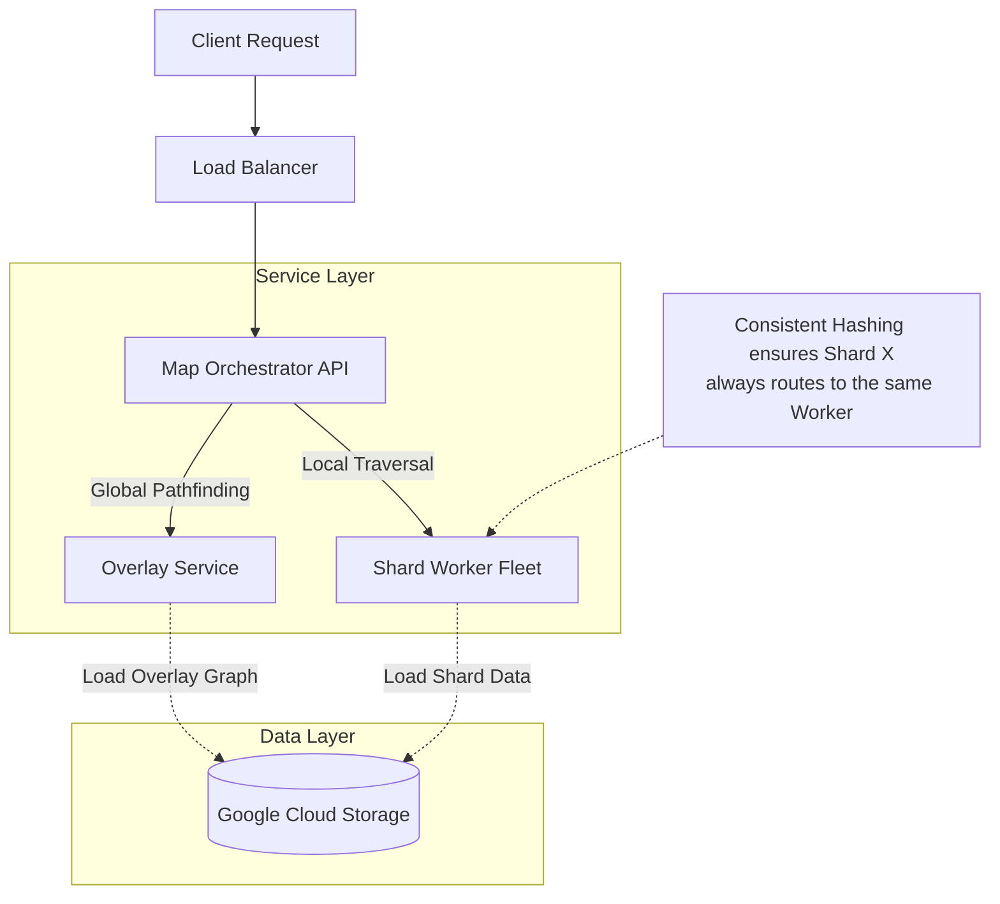

# Map Service Backend: Distributed Graph System Design

## 1. Problem Specification

### 1.1 Core Requirements
The system serves as a backend for a map service operating on a massive, geographically sharded graph. It must satisfy three primary query types:
1.  **Closest Node:** Identify the graph node nearest to a specific set of geographical coordinates.
2.  **Shortest Path:** Calculate the optimal route between Node A and Node B.
3.  **Shard Debugging:** Retrieve all nodes within a specific shard (for maintenance/debugging).

### 1.2 Data Structures & Terminology
The graph data is pre-processed and stored in a Google Cloud Storage (GCS) bucket. The topology is defined as follows:

* **Shard:** A distinct geographical partition of the massive graph.
* **Ridge:** An edge that connects a node in one shard to a node in a different shard.
* **Boundary Node:** A node that possesses at least one "Ridge" (i.e., it sits on the border of a shard).
* **Overlay Graph:** A simplified, high-level graph consisting of:
    * All **Boundary Nodes**.
    * **Ridges** (edges connecting shards).
    * **Shortcuts** (pre-calculated shortest paths between every pair of boundary nodes *within* the same shard).

### 1.3 Performance Constraints
* **Scalability:** The system must support dynamic scaling of worker nodes to handle varying load.
* **Caching:** To ensure low latency, recently accessed shards must be cached in memory. Repetitive computations on the same shard should not trigger GCS downloads.
* **Memory constraints:** The Overlay Graph fits in memory. A single Shard fits in memory. The *Total* Graph does not fit in memory.

---

## 2. High-Level Cluster Architecture

The solution utilizes a **Scatter-Gather** architecture orchestrated by a central gateway. To meet the caching requirement, we utilize **Consistent Hashing** to route queries for specific shards to specific workers, maximizing cache hit rates.

### 2.1 Component Diagram

---

## 3. Detailed Component Design

### 3.1 Map Orchestrator (The Router)

* **Type:** Stateless Microservice.
* **Responsibilities:**
* **Coordinate Translation:** Uses an in-memory spatial index (e.g., S2 or H3) to translate `(Lat, Lon)`  `Shard ID`.
* **Consistent Hashing:** Maintains a hash ring of available Shard Workers. Routes requests for `Shard X` to the specific worker responsible for that hash range.
* **Request Assembly:** Aggregates partial results from the Overlay Service and Shard Workers to form the final path.

* **Scalability:** Standard Horizontal Pod Autoscaling (CPU-based).

### 3.2 Overlay Service (The Global Planner)

* **Type:** Stateful (Read-Only) Microservice.
* **Responsibilities:**
* Loads the full `overlay_graph.dat` into RAM at startup.
* Calculates shortest paths between **Boundary Sets**. (e.g., "Find the cheapest path from *any* boundary node of Shard A to *any* boundary node of Shard B").

* **Scalability:** ReplicaSet. Since the data is read-only and identical across pods, simple Round-Robin load balancing applies.

### 3.3 Shard Worker Fleet (The Local Guides)

* **Type:** Stateful (Caching) Microservice.
* **Responsibilities:**
* **On-Demand Loading:** Receives a request for `Shard ID`. Checks internal LRU Cache. If missing, fetches `shard_{id}.dat` from GCS.
* **Local Pathfinding:** Runs Dijkstra/A* from a local start node to all local boundary nodes.

* **Memory Management:** Implements an LRU (Least Recently Used) eviction policy.
* *Capacity:* Example: 5GB RAM per pod.
* *Behavior:* If full, evict the shard that hasn't been queried in the longest time.

* **Scalability:** Custom Metrics HPA (Scaling on **Memory Pressure**).

---

## 4. Query Execution Flow

### 4.1 Shortest Path (Node A in Shard 1  Node B in Shard 2)

This requires a multi-stage calculation:

1. **Orchestrator** identifies: Start  Shard 1, End  Shard 2.
2. **Parallel Execution (Scatter):**
* **Request 1 (to Worker Hash(S1)):** "Calculate cost from Node A to all Boundary Nodes of Shard 1."
* **Request 2 (to Worker Hash(S2)):** "Calculate cost from Node B to all Boundary Nodes of Shard 2 (Backward Search)."
* **Request 3 (to Overlay Service):** "Calculate cost matrix between Boundary Set(S1) and Boundary Set(S2)."

3. **Aggregation (Gather):**
* The Orchestrator receives three sets of costs.
* It iterates through the combinations to find the minimum total cost.

4. **Result Construction:** The detailed path is reconstructed by asking the workers for the specific edge sequence of the winning route.

---

## 5. Kubernetes Implementation Specs

### 5.1 Infrastructure

* **Node Pools:**
* *General:* For Orchestrator and System components.
* *High-Mem:* For Shard Workers and Overlay Service (optimizing for RAM).

* **Storage:**
* Ephemeral SSDs (scratch space) mounted to Workers to speed up GCS unzip/parse operations.

### 5.2 Scaling & Discovery

* **Service Discovery:** A Headless Service is used for the Shard Workers so the Orchestrator can resolve individual Pod IPs to build the Consistent Hash Ring.
* **Resilience:** If a Worker Pod dies:
1. The Hash Ring in the Orchestrator detects the failure.
2. The shard ownership re-hashes to the *next* available worker in the ring.
3. That worker fetches the data from GCS (cold start penalty, but system remains available).

### 5.3 API Definition (Internal)

| Service | Endpoint | Method | Payload |
| --- | --- | --- | --- |
| **Worker** | `/shard/{id}/boundaries` | POST | `{ "start_node": 123 }` |
| **Worker** | `/shard/{id}/debug` | GET | `(Empty)` |
| **Overlay** | `/path/inter-shard` | POST | `{ "shard_source": 1, "shard_dest": 2 }` |