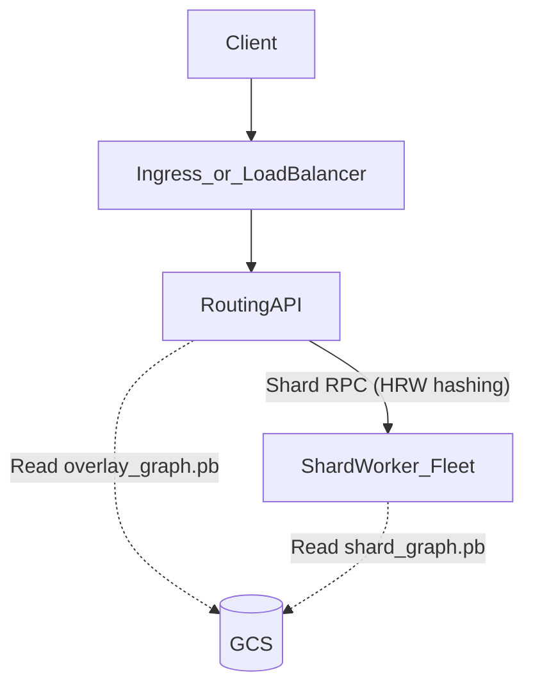

# Cluster (MVP): Routing API + Shard Workers (Kubernetes + GCS)

This document describes the minimal serving cluster that matches [`API.md`](API.md).

## GCS inputs (protobuf)
Schema: [`protos/gcs_storage.proto`](protos/gcs_storage.proto)

- `gs://<bucket>/protos/overlay_graph.pb`
  - `bridges`: cross-shard edges
  - `shortcuts`: precomputed boundary-to-boundary edges (weights only)
  - `boundary_locations`: node_id → (lat,lng) for boundary nodes
- `gs://<bucket>/protos/shard_id=<S2>/shard_graph.pb`
  - `edges`: intra-shard directed edges
  - `locations`: node_id → (lat,lng) for nodes in this shard
  - `boundary_in_node_ids`, `boundary_out_node_ids`

## Services

- `routing-api`
  - Loads `overlay_graph.pb`.
  - Serves `/v1/route` and `/v1/route/expand`.
  - Routes shard-local requests to workers via rendezvous hashing (HRW) on `shard_id`.
- `shard-worker`
  - Caches `shard_graph.pb` for hot shards (LRU).
  - Provides shard-local operations: snapping, distances to boundary sets, in-shard expansion.

## Algorithms

### `POST /v1/route`
1. `routing-api` computes `start_shard`, `end_shard` (S2 level 9).
2. In parallel, call shard workers:
   - `W(start_shard)` returns:
     - snapped `start` as `NodeRef`
     - `dist_start_to_out[b_out]` for all `boundary_out_node_ids`
   - `W(end_shard)` returns:
     - snapped `end` as `NodeRef`
     - `dist_in_to_end[b_in]` for all `boundary_in_node_ids` (reverse Dijkstra from `end`)
3. `routing-api` runs multi-source Dijkstra on the overlay graph, seeded by `dist_start_to_out`.
4. Choose best target boundary node:

\[
b^* = \arg\min_{b \in BoundaryIn(endShard)} distOverlayFromStart[b] + dist_{in\_to\_end}[b]
\]

5. Reconstruct waypoint node IDs: `start_node_id -> ...boundary nodes... -> end_node_id`.
6. Return `segments[]` as consecutive `NodeRef` pairs (`start`, `end`).
   - For unexpanded segments, set `polyline` to exactly `[start, end]`.
   - Set `expandable=true` for same-shard segments (and `false` for cross-shard bridge segments).

### `POST /v1/route/expand`
For each segment `(start: NodeRef, end: NodeRef)`:
- compute shards from `start.lat/lng` and `end.lat/lng`
- same shard: route to `W(shard)` and expand `start.node_id -> end.node_id` on `ShardGraph.edges`, returning an expanded `polyline` and `expandable=false`
- different shards (bridge): return an unexpanded segment with `polyline` set to `[start, end]` and `expandable=false`
